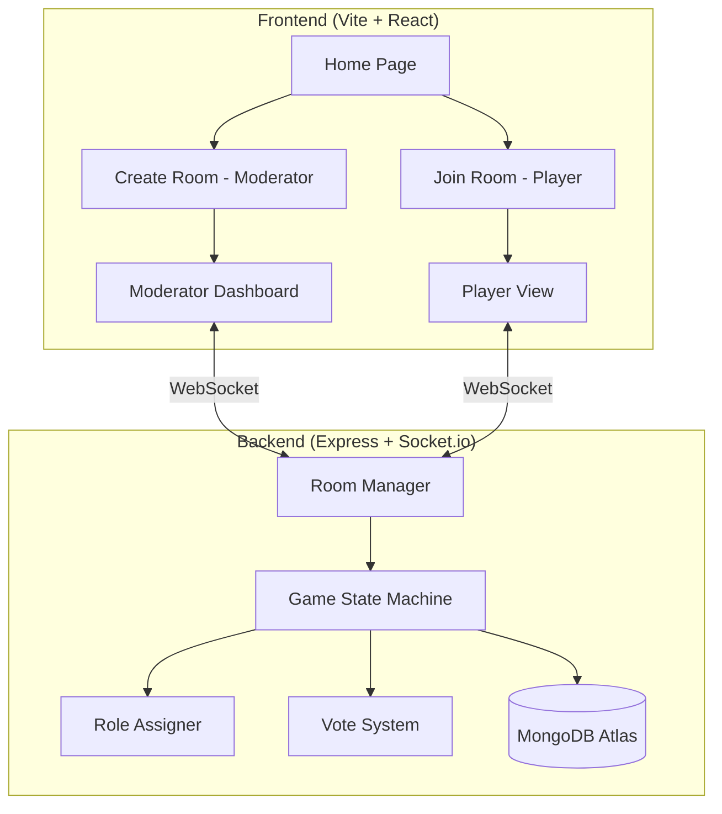

# System Architecture & Tech Specs

## Architecture Diagram

### Tech Stack
- **Frontend**: Vite + React (Single Page App)
- **Backend**: Express.js + Socket.io (real-time communication)
- **Database**: MongoDB Atlas + Prisma ORM / Driver (player stats, extensible roles)
- **Styling**: Vanilla CSS with dark theme, glassmorphism, animations
- **i18n**: JSON translation files (TH/EN) + React Context

### Deployment
- **Frontend**: Vercel / Netlify (ฟรี)
- **Backend**: Railway / Render (ฟรี tier)
- ใช้ environment variable สำหรับ server URL
- ไม่จำกัด Local Network — ใช้งานผ่าน internet ได้

---

## Game Framework

### 🎲 Game Flow
1. **Lobby**: Moderator creates room → Players join via room code
2. **Role Assignment**: Moderator starts game → Server randomly assigns roles → Each player sees their role privately
3. **Night Phase**: Werewolves vote to kill, Seer checks a player, Bodyguard protects a player (all via app)
4. **Day Phase**: Discussion → All players vote to eliminate someone
5. **Resolution**: Check win conditions → Loop to Night or end game

### 🎭 Roles Supported
| Role | Team | Night Action |
|------|------|-------------|
| 🐺 Werewolf | Werewolf | Vote unanimously to kill a villager |
| 👁️ Seer | Village | Check one player's role |
| 🛡️ Bodyguard | Village | Protect one player. Cannot protect same person 2 nights in a row |
| 👤 Villager | Village | No action (sleeps) |

---

## Technical Components Breakdown

### Backend (`/server`)

| File | Responsibility |
|------|---------------|
| `index.js` | Express server setup, Socket.io event receivers, REST auth endpoints, CORS rules |
| `gameManager.js` | Room CRUD, player tracking, Socket ID mapping, Disconnect handling |
| `gameLogic.js` | Role distribution, Phase transitions, Night action tallying, Win condition checks |
| `auth.js` | JWT creation/verification, User statistics fetching, Bcrypt hashing |

### Frontend (`/client`)

| Path/File | Responsibility |
|-----------|---------------|
| `src/socket.js` | Socket.io singleton connection provider |
| `src/pages/ModeratorView.jsx` | Control dashboard for starting game, advancing phases, and seeing all player status |
| `src/pages/PlayerView.jsx` | Mobile-focused interface for casting votes and checking roles (hide-reveal mechanic) |
| `src/pages/CreateRoom.jsx` | Interface to configure the exact count of each role before generating a lobby |
| `src/pages/JoinRoom.jsx` | Form to drop in room code + name |
| `src/i18n/` | Localization context wrapping the whole App component |
| `src/index.css` | 100% of the project's CSS! Variables, animations, dark mode theme tokens |
