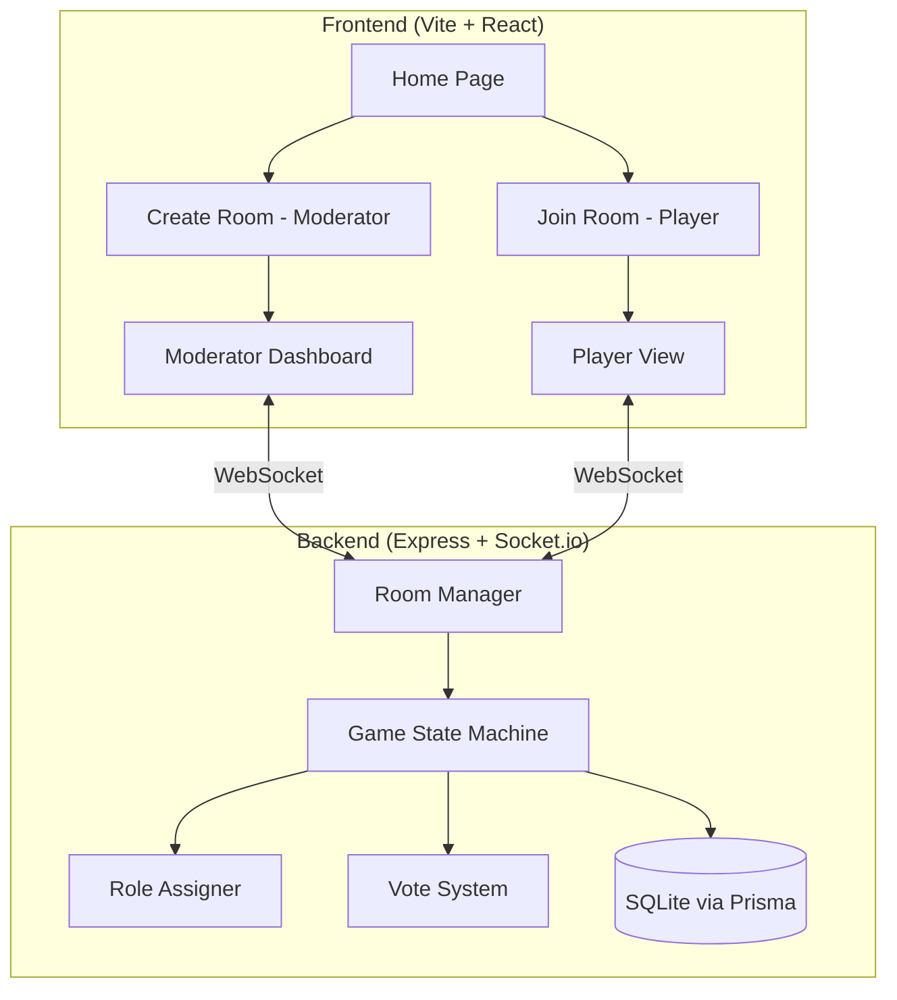

# Werewolf Moderator Web App

สร้าง Web App สำหรับเกม Werewolf ที่ให้ Moderator จัดการเกมผ่านหน้าจอของตัวเอง และ Player เข้าร่วมผ่านมือถือ รองรับการสุ่มบทบาท, ระบบ vote, และ game flow ทั้งกลางวันและกลางคืน

## Architecture



### Tech Stack
- **Frontend**: Vite + React (Single Page App)
- **Backend**: Express.js + Socket.io (real-time communication)
- **Database**: SQLite + Prisma ORM (player stats, extensible roles)
- **Styling**: Vanilla CSS with dark theme, glassmorphism, animations
- **i18n**: JSON translation files (TH/EN) + React Context

### Deployment
- **Frontend**: Vercel / Netlify (ฟรี)
- **Backend**: Railway / Render (ฟรี tier)
- ใช้ environment variable สำหรับ server URL
- ไม่จำกัด Local Network — ใช้งานผ่าน internet ได้

### Game Flow
1. **Lobby**: Moderator creates room → Players join via room code
2. **Role Assignment**: Moderator starts game → Server randomly assigns roles → Each player sees their role privately
3. **Night Phase**: Werewolves vote to kill, Seer checks a player, Doctor saves a player, Bodyguard protects a player (all via app)
4. **Day Phase**: Discussion → All players vote to eliminate someone
5. **Resolution**: Check win conditions → Loop to Night or end game

### Roles Supported
| Role | Team | Night Action |
|------|------|-------------|
| 🐺 Werewolf | Werewolf | Vote to kill a villager |
| 👁️ Seer | Village | Check one player's role |
| 💊 Doctor | Village | Save one player from death |
| 🛡️ Bodyguard | Village | Protect one player — if targeted by wolves, that player survives. Bodyguard stays alive (wolves don't know). Cannot protect same person 2 nights in a row |
| 👤 Villager | Village | No action (sleeps) |

### Doctor vs Bodyguard
- **Doctor**: รักษาคนที่ถูกโจมตี (reactive) — ถ้าหมอรักษาถูกคน คนนั้นรอด
- **Bodyguard**: ปกป้องคนล่วงหน้า (proactive) — ถ้า Bodyguard ปกป้องถูกคน คนนั้นรอด, Bodyguard ไม่ตาย
- ทั้งสองตัวทำหน้าที่คล้ายกันแต่เป็นคนละคน ถ้าทั้ง Doctor และ Bodyguard เลือกคนเดียวกัน ก็ช่วยซ้ำ (คนนั้นรอดแน่นอน)

---

## Database Schema (Prisma + SQLite)

เผื่ออนาคต: เก็บสถิติผู้เล่น และรองรับการเพิ่ม role ใหม่

```prisma
model Role {
  id             Int           @id @default(autoincrement())
  name           String        @unique
  team           String        // "werewolf" | "village"
  description    String?
  hasNightAction Boolean       @default(false)
  createdAt      DateTime      @default(now())
  gamePlayers    GamePlayer[]
}

model Player {
  id          Int           @id @default(autoincrement())
  username    String
  createdAt   DateTime      @default(now())
  gamePlayers GamePlayer[]
}

model Game {
  id          Int           @id @default(autoincrement())
  roomCode    String
  status      String        // "lobby" | "playing" | "finished"
  winnerTeam  String?       // "werewolf" | "village" | null
  playerCount Int
  rounds      Int           @default(0)
  startedAt   DateTime?
  endedAt     DateTime?
  createdAt   DateTime      @default(now())
  gamePlayers GamePlayer[]
  gameEvents  GameEvent[]
}

model GamePlayer {
  id         Int      @id @default(autoincrement())
  game       Game     @relation(fields: [gameId], references: [id])
  gameId     Int
  player     Player   @relation(fields: [playerId], references: [id])
  playerId   Int
  role       Role     @relation(fields: [roleId], references: [id])
  roleId     Int
  isAlive    Boolean  @default(true)
  deathRound Int?
  deathCause String?  // "werewolf" | "voted" | null
  isWinner   Boolean  @default(false)
}

model GameEvent {
  id        Int      @id @default(autoincrement())
  game      Game     @relation(fields: [gameId], references: [id])
  gameId    Int
  round     Int
  phase     String   // "night" | "day"
  actorName String?
  targetName String?
  action    String   // "kill" | "check" | "save" | "protect" | "vote"
  result    String?
  createdAt DateTime @default(now())
}
```

---

## Proposed Changes

### Backend (`/server`)

#### [NEW] package.json
Express + Socket.io + cors + Prisma dependencies

#### [NEW] index.js
- Express server with Socket.io setup
- CORS configuration
- Socket event handlers for all game actions:
  - `create-room`, `join-room`, `start-game`
  - `night-action` (werewolf kill, seer check, doctor save, bodyguard protect)
  - `day-vote`, `skip-vote`
  - `next-phase`, `end-game`

#### [NEW] gameManager.js
- Room CRUD (create, join, leave, delete)
- Random 4-digit room code generation
- Player management (add/remove/track status)

#### [NEW] gameLogic.js
- Role assignment (shuffle & distribute)
- Night phase resolution (who dies, who was saved/protected)
- Bodyguard logic (cannot protect same person 2 nights in a row)
- Day phase vote tallying
- Win condition checks (all wolves dead / wolves ≥ villagers)

#### [NEW] prisma/schema.prisma
- Database schema for stats and future role expansion

---

### Frontend (`/client`) — Vite + React

#### [NEW] package.json
Vite + React + Socket.io-client + React Router

#### [NEW] src/App.jsx
Main app with React Router routes + i18n Provider

#### Pages:

#### [NEW] src/pages/Home.jsx
Landing page — "Create Room" or "Join Room" buttons + language switcher

#### [NEW] src/pages/CreateRoom.jsx
Moderator setup: set player count, configure role distribution, create room

#### [NEW] src/pages/JoinRoom.jsx
Player joins by entering room code + name

#### [NEW] src/pages/ModeratorView.jsx
- See all players, their alive/dead status
- Control game phases (start night, start day, resolve)
- See vote results (who werewolves chose, seer result, doctor choice, bodyguard choice)
- Announce deaths and game results

#### [NEW] src/pages/PlayerView.jsx
- See own role (with card flip animation)
- Night actions (vote UI for werewolves, check UI for seer, save UI for doctor, protect UI for bodyguard)
- Day voting
- Status indicators (alive/dead, current phase)

#### Shared:

#### [NEW] src/socket.js
Socket.io client singleton

#### [NEW] src/i18n/th.json + en.json
Translation files for Thai and English

#### [NEW] src/i18n/index.jsx
i18n Context Provider with language switching

#### [NEW] src/index.css
Full design system: dark theme, glassmorphism cards, glow effects, animations, responsive mobile-first layout

---

## Verification Plan

### Browser Testing
1. Start backend: `cd server && node index.js`
2. Start frontend: `cd client && npm run dev`
3. Open moderator in one browser tab → Create room
4. Open 4-5 player tabs → Join room with different names
5. Test complete game flow:
   - Verify roles are assigned randomly and shown correctly
   - Verify night phase voting (werewolf kill, seer check, doctor save, bodyguard protect)
   - Verify day phase voting and elimination
   - Verify win condition detection
   - Verify Bodyguard cannot protect same person 2 nights in a row

### Mobile Responsiveness
- Use browser DevTools to simulate mobile viewport
- Verify touch-friendly buttons and readable text on small screens
